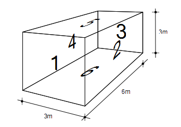

# SEA-Matlab-GUI
This Matlab code provides a graphical user interface for the SEA modelling of plates and cavities.

The code was developed and validated by Dionysios Panagiotopoulos, Christian Robl and Khalid Malik under the supervision of Chistoph Winter during a software project in the study program "Comutational Mechanics (M.Sc.)" at the Chair of Structural Mechanics at Technical University of Munich.

Last Version (March 2017) by Dionysios Panagiotopoulos. 

The source code is published here under the GNU GENERAL PUBLIC LICENSE Version 3. see LICENSE file.

#Instructions for use

The GUI is launched by executing (Run) the SEA_main.m (in the GUI folder) in Matlab. 

The use of this tool is explained in the following by modelling a room consisting out of 6 plates and one cavity:

All plates shall have thickness of 0.01m and the material properies of construction steel. The cavity is filled with air under normal condidtions.

The GUI is seperated in a preprocessing and in a postprocessing section and provides a visualization area.

The fist step is to create the subsystems. The subsystems can be moved by drag-and-drop in the visualization area in order to improve the visuatization. The plate subsystems are placed here around the cavity:

 

In the next step the subsystem paramters (geometrical dimensions and material parameters) have to be set. The settings are stored by clicking on "Apply" and the pop-up window is closed by clicking on "Finish":

 

The wavetypes, which shall be considered, have to be choosen before adding the couplings of the subsystems:

 

Fist the type of connection (L, T, or X) has to be choosen. The L-connection connects two subsystems along one itersection. This is the only connection necessary for this example. The T- and X-connections couple 3 rep. 4 subsystems along one intersection. They are necassary if one would model e.g. two ore more adjacent rooms.
The connection length has to be set for the coupling of two plate subsystems. This is not necessary for the coupling of a plate and a cavity:

 

The connections are visualized after clicking on "Apply" and "Finish":

 

Some solution option (like the consideration of non-resonant transmission or in-plane waves) can be choosen. Also a path analyses via which subsystems the energy flows from one subsystem to another not adjacent (directly coupled) subsystem. In this example none of the options are applied:

 

Last step in the preprocessing is the setting of the power input. We insert here a power of 10 Watt into the subsystem "Plate 1":

 

Clicking on "Solve" solves the linear system of SEA-equations and activates the postprocessing:

In the postprocessing section the results can be plotted over the frequency in a log-scale. Therefore, one has to select a quantity and the subsystems resp. couplings for which this quantity should be plotted. Multiple selection with Strg+click is possible in both columns.

